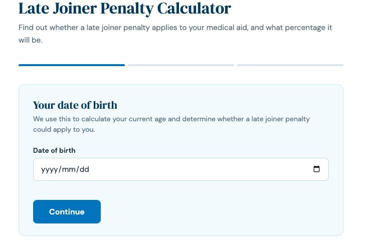

# Late Joiner Penalty Calculator
A client-facing web tool built for Rehealth to help South Africans determine whether a late joiner penalty applies to their medical aid, and what percentage that penalty will be.

🌐 **Live Demo:** https://micoleolivia.github.io/Late_Joiner_Penalty/

---

## Overview

Joining a medical aid scheme in South Africa for the first time (or after a gap in cover) may result in a **late joiner penalty**, a percentage loading added to your monthly premium. This tool walks users through a simple step-by-step form to calculate their penalty based on their age and years of credible medical aid cover.

The project was built to demonstrate skills in frontend web development, form logic, and user experience design for a real-world healthcare client.

---

## Features

- 🎂 Date of birth input with automatic age calculation
- 🚦 Instant exit for users under 21 (no penalty applicable)
- 📋 Dynamic membership date inputs based on number of prior medical aid memberships
- ✂️ Credible cover automatically clipped to age 21
- 📄 Certificate check per membership with affidavit warning if no certificate is held
- 📊 Clean result display with penalty percentage
- 📱 Fully responsive and mobile friendly
- 🔌 WordPress compatible — paste directly into an HTML block

---

## Dashboard Preview



---

## How the Penalty is Calculated

```
Penalty Score = Age − (35 + Years of Credible Cover)
```

Where **credible cover** refers to all years of South African medical aid membership since the age of 21.

| Penalty Score | Premium Loading |
|---|---|
| 0 – 4 | 5% |
| 5 – 14 | 25% |
| 15 – 24 | 50% |
| 25+ | 75% |

If the score is 0 or below, no penalty applies.

---

## Technologies Used

- HTML
- CSS
- Vanilla JavaScript

---

## Repository Structure

```
LateJoinerCalculator/
│
├── index.html
├── style.css
├── script.js
├── screenshots/
│   └── dashboard.png
└── README.md
```

---

## Run Locally

```bash
git clone https://github.com/<YOUR GITHUB USERNAME>/LateJoinerCalculator.git
cd LateJoinerCalculator
```

Then open `index.html` in your browser — no installation needed!

---

## Author

**Micole Dmochowska**

Actuarial Science Honours graduate with an interest in data analytics, healthcare analytics, AI, and building tools that make complex information accessible to everyday people.
